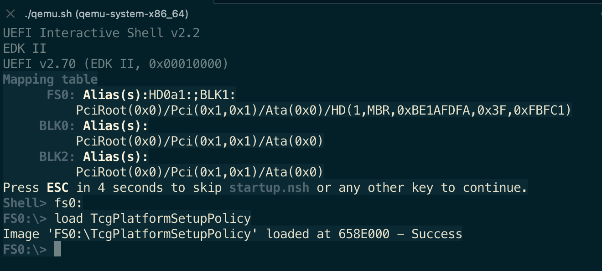
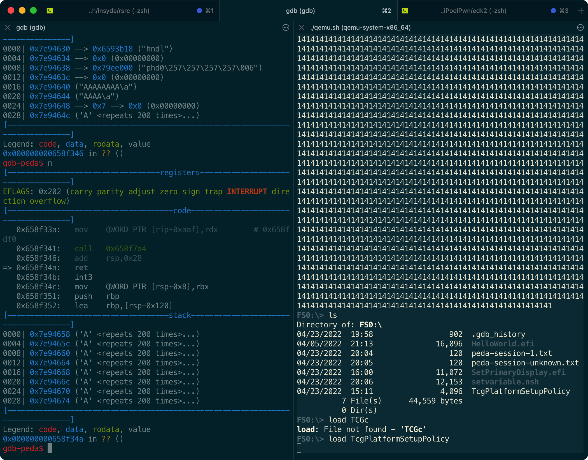
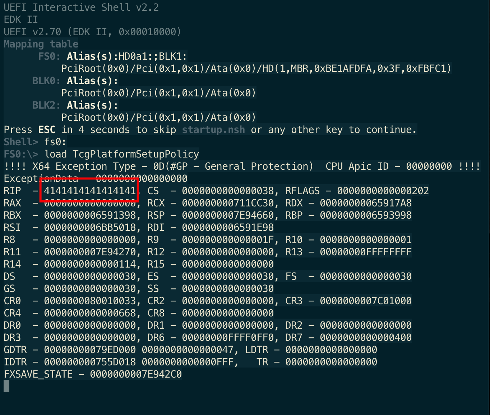
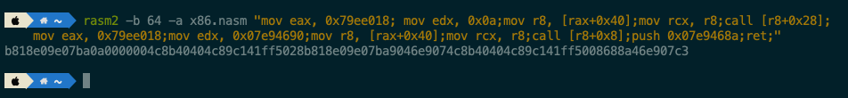
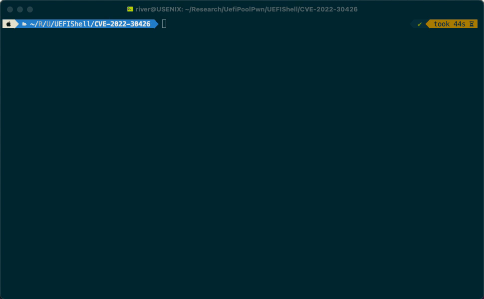

There is a stack buffer overflow vulnerability, which could lead to **arbitrary code execution in UEFI DXE driver** in the latest firmware of Acer's Altos servers (and some laptops).

The vulnerability has been reported to the vendor, however Acer's security team claims that all these affecting models are already end of life. So we decided to disclose the detail.

## Summary

Previously, we did a lot of research in existing works in UEFI security, an example is that Binarly-IO found a lot of vulnerabilities since last years. And there is also a paper in S&P2022 mainly focused on SMM callout vulnerabilities. We believe that the security of UEFI ecosystem remains construction, so we started to do some trivial works. 

This vulnerability is similar to CVE-2021-42059(found by Binarly-IO), the vulnerability exists due to the incorrect use of the `gRT->GetVariable` service in driver `TcgPlatformSetupPolicy`.

Affecting models:

1. Altos T110 F3, before P13
2. AP130 F2, before P04
3. Aspire 1600X, before P11.A3L
4. Aspire 1602M, before P11.A3L
5. Aspire 7600U, before P11.A4
6. Aspire MC605, before P11.A4L
7. Aspire TC-105, before P12.B0L
8. Aspire TC-120, before P11-A4
9. Aspire U5-620, before P11.A1
10. Aspire X1935, before P11.A3L
11. Aspire X3475, before P11.A3L
12. Aspire X3995, before P11.A3L
13. Aspire XC100, before P11.B3
14. Aspire XC600, before P11.A4
15. Aspire Z3-615, before P11.A2L
16. Veriton B630_49, before AAP02SR 
17. Veriton E430G, before P21.A1
18. Veriton E430, before P11.A4
19. Veriton M2110G, before P21.A3
20. Veriton M2120G, before P11-A3
21. Veriton M2611G, before P11-B0L
22. Veriton M2611, before P11.B0
23. Veriton M4620, before P21.A3
24. Veriton M4620G, before P21.A3
25. Veriton M6620G, before P21.A0
26. Veriton N2620G, before P21.B0
27. Veriton N4620G, before P11.A2L
28. Veriton N4630G, before P21.B0
29. Veriton S6620G, before P11.A1
30. Veriton X2611G, before P11.A4
31. Veriton X2611, before P11.A4
32. Veriton X4620G, before P11.A3
33. Veriton X6620G, before P11.A3
34. Veriton Z2650G, before P21.A1

## Vulnerability Description

Vulnerability exists in function located offset `0x7A4` in `TcgPlatformSetupPolicy`.

The latest firmware can be downloaded here: https://www.acer.com/ac/en/US/content/support-product/7914?b=1

```C
__int64 __fastcall sub_7A4(void *a1, __int64 a2){
  //.....
  if ( (gBS->AllocatePool(EfiBootServicesData, 0x28ui64, &Buffer) & 0x8000000000000000ui64) != 0i64 )
    return 0x8000000000000009ui64;
  
  if ( (gRT->GetVariable("InternalDisallowTpmFlag", &gTcgInternalflagGuid, &Attributes, &DataSize, &Data) & 0x8000000000000000ui64) != 0i64 )
  {
    LOBYTE(Data) = 0;
LABEL_5:
    Attributes = 3;
    v3 = gRT->GetVariable("TcgInternalSyncFlag", &gTcgPpiSyncFlagGuid, &Attributes, &DataSize, &v29);
    v4 = v29;
    if ( v3 < 0 )
      v4 = 0;
    v29 = v4;
    v5 = gRT->GetVariable(aSetup, &gSetupVariableGuid, &Attributes, &v7, v10);
    *(_BYTE *)Buffer = 3;
    v6 = (char *)Buffer + 1;
    if ( v5 >= 0 )
 //......
}
```

The above codes simply do following things:

1. Use `GetVariable` service to read the variable `InternalDisallowTpmFlag` from NVRAM.
2. If the previous step fails, which would return a negative error code, the execution flow will enter the if section, and will use `GetVariable` service to read the variable `TcgInternalSyncFlag` instead.


**The problem is,  the two calls share a same `DataSize` value.**

If the value of  variable `InternalDisallowTpmFlag` is a very large string, after the first call to `gRT->GetVariable`, the value of `DataSize` will be updated to the size of `InternalDisallowTpmFlag`.

Thus the second call to `gRT->GetVariable` may cause a stack overflow if `TcgInternalSyncFlag` 's size is large than the buffer. 


## Vulnerability Analysis

We have write a PoC script, that  overwrites the return address to "AAAA".

Before we run the exploit, use the EmulatorPKG build from EDK2, and simply load the driver.



The driver is loaded successfully. 

We can simply use a `nsh` script to set the variable value:

```nsh
setvar InternalDisallowTpmFlag -guid 70FFF0FF-A543-45B9-8BE3-1BDB90412080 -bs -rt -nv =41414141414141414141414141414141414141414141414141414141414141
//......
4141414141414141414141414141414141414141414141414141414141414141414141414141414141414141414141414141414141414141414141414141414141414141414141414141414141414141414141414141414141

```

After running the script, the variable `InternalDisallowTpmFlag` has been set to a large string full of "AAAA". Of course, we can do the same to `TcgInternalSyncFlag`.

Using gdb to debug, we can see that when the entry function of the driver trys to return, the return address has been overflowed to our payload.



And because the variable is stored in the NVRAM, the next time we try to load the driver, the shellcode will still be triggered thus cause a exception.



Since we can control the **RIP**, we can further write shellcode in the stack. There isn't ALSR or NX in UEFI DXE phase, so it's quite simple to construct the shellcode to perform a call to `ConOut->OutputString`.

We can use rasm2 to generate the shellcode.



The hardcoded addresses are :

- 0x79ee018 -- SystemTable
- 0x7e94660 -- return address, address of the shellcode
- 0x7e94690 -- address of the string
- 0x7e9468a -- address of the push ret dead loop

Run the script to set two variables and load the driver; we can see that the control flow is hijacked and we successfully print a string.



In conclusion, an attack can exploit this vulnerability to **escalate privilege from ring 3 or ring 0**(depends on the operating system) to DXE Runtime UEFI application and **execute arbitrary code**.

A **malicious code can be installed** which could **survive across an operating system (OS) boot process** and modify NVRAM area in SPI flash storage (to gain persistence on target platform).


## Credit

This vulnerability credited to [river-li](https://github.com/river-li) and [cft789](https://github.com/cft789).


