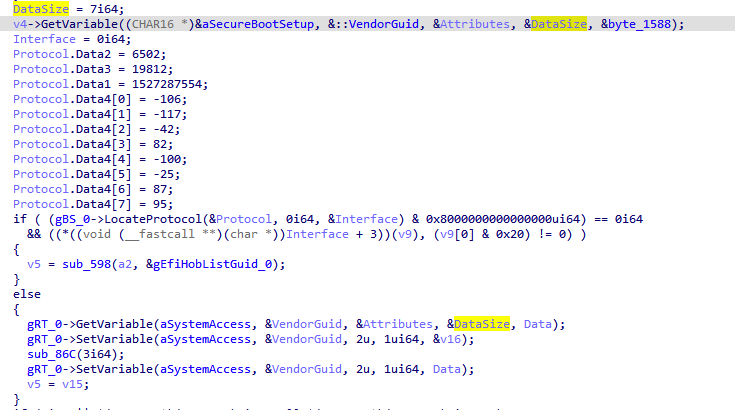
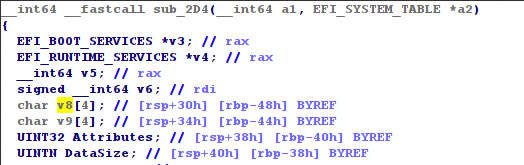
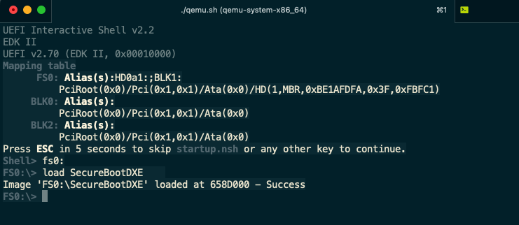
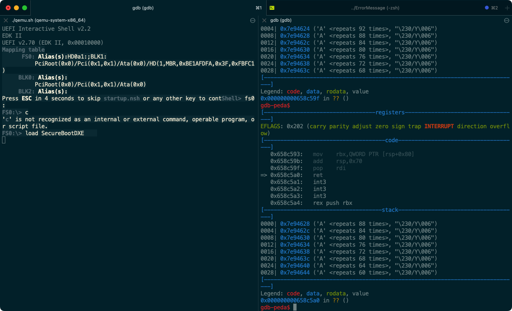
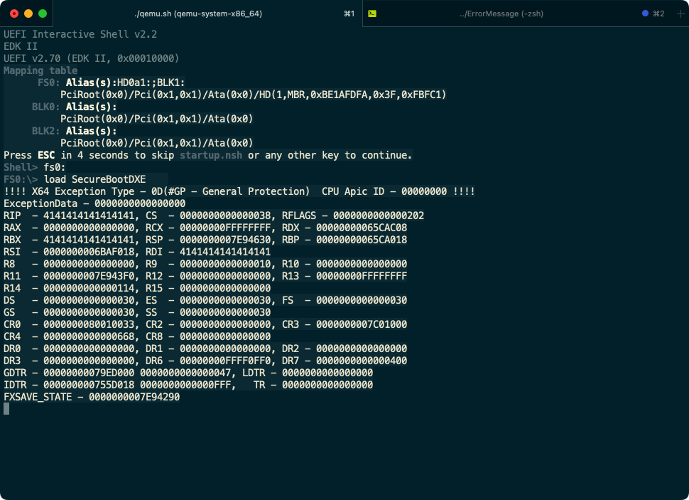

There is a vulnerability in the latest version of BIOS firmwares in multiple ThinkCenter Desktops, which could lead to **arbitrary code execution in UEFI DXE phase**.

Take ThinkCenter M715s Desktop for example, the latest version of the firmware can be downloaded here: https://download.lenovo.com/pccbbs/thinkcentre_bios/o2vjya7usa.exe. 

This firmware is updated in 05 July, 2022.

## Vulnerability Description

There is a stack-based buffer overflow vulnerability in Lenovo desktops, the vulnerability exists due to incorrect use of the `gRT->GetVariable` service in driver `SecureBootDXE`.

The root cause exists in function located offset `0x2D4` in `SecureBootDXE`.




The above codes first using `GetVariable` service to get the variable `SecureBootSetup`'s value from the NVRAM.

After that, the execution flow trys to call `LocateProtocol`; and if that succeeded trys to dereference a function pointer in the interface.

If there is something wrong (Since the DXE Dispatcher is not dispatching each drivers in a fixed sequence, this is quite possible to happen), the execution flow would enter the else section, that will try to call `GetVariable` to read the value of `SystemAccess`.

**The problem is,  when the control flow enters the `else` section, the call to `GetVariable` share a same `DataSize` with the previous one.** And the value is not reinitialized.

If the value of  variable `SecureBootSetup` is a very large string, after the first call to `gRT->GetVariable`, the value of `DataSize` will be updated to the size of a large int number.



More importantly, the buffer that the second call to `GetVariable` trys to write in is 0x44 below rbp, which means if the content is longer than 0x44 bytes, the rbp and the return address of the function might be overwritten. 

Thus the following call to `gRT->GetVariable` may cause a stack overflow if `SystemAccess`'s size (or other variable's size) is large than the original buffer. 

## Vulnerability Analysis

We first write a PoC script, that overwrites the return address to "AAAA".

Before we run the exploit, use the Emulator build from EDK2, and directly load the driver.



The driver is loaded successfully. The PoC is written in a `nsh` script:

```nsh
setvar SecureBootSetup -guid 7b59104a-c00d-4158-87ff-f04d6396a915 -bs -rt -nv =41414141414141414141414141414141414141414141414141414141414141414141414141414141414141414141414141414141414141414141414141414141414141414141414141414141414141414141414141414141414141414141414141414141414141414141414141414141414141414141414141414141414141414141414141414141414141414141414141414141414141414141414141414141

setvar SystemAccess -guid e770bb69-bcb4-4d04-9e97-23ff9456feac -bs -rt -nv =41414141414141414141414141414141414141414141414141414141414141414141414141414141414141414141414141414141414141414141414141414141414141414141414141414141414141414141414141414141414141414141414141414141414141414141414141414141414141414141414141414141414141414141414141414141414141414141414141414141414141414141414141414141
```

After running the script, the variable `SecureBootSetup` and `SystemAccess` will be set to a large string full of "AAAA".

Using gdb to debug, we can see that when the function `sub_2D4` trys to return, the return address has been overflowed to our payload.



And because the variable is stored in the NVRAM, the next time we trys to load the driver, the shellcode will still be triggered thus cause a exception.



This exception occurs because the return address of the parent function has been overwrited to AAAAAAAA

Since we can control the **RIP**, we can further write shellcode in the stack to perform a arbitary code execution. 

In conclusion, an attack can exploit this vulnerability to execute arbitrary code in DXE phase. And a **malicious code can be installed** as a result, which could **survive across an operating system (OS) boot process**.


## Credits

This vulnerability is found by Zichuan Li([@river-li](https://github.com/river-li)) and Fangtao Cao([@cft789](https://github.com/cft789)).
